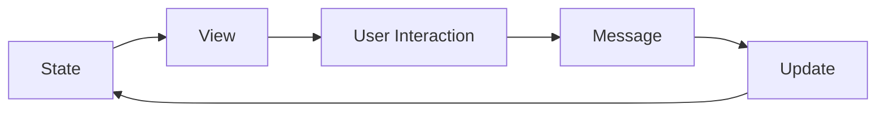

# Architecture

Iced is a cross-platform GUI library for Rust that follows **The Elm Architecture** pattern. This architecture provides a simple, type-safe, and predictable way to build user interfaces.

## The Elm Architecture Pattern

Iced splits user interfaces into four distinct concepts:

<Steps>
  <Step title="State">
    The state of your application - all the data your UI depends on
  </Step>
  <Step title="Messages">
    User interactions or meaningful events that can change your state
  </Step>
  <Step title="View Logic">
    How to display your state as widgets that produce messages
  </Step>
  <Step title="Update Logic">
    How to react to messages and update your state
  </Step>
</Steps>

<Info>
  This architecture is inspired by [Elm](https://elm-lang.org/), a functional programming language for building web applications.
</Info>

## Core Principles

### Type Safety

Iced leverages Rust's type system to its full extent. The connection between your state, messages, view, and update logic is enforced at compile time:

```rust
fn update(counter: &mut u64, message: Message) {
    match message {
        Message::Increment => *counter += 1,
    }
}

fn view(counter: &u64) -> Element<'_, Message> {
    button(text(counter)).on_press(Message::Increment).into()
}
```

Notice how the `view` function returns an `Element<Message>`, ensuring that any messages produced by widgets match the messages expected by `update`.

### Unidirectional Data Flow

Iced enforces a unidirectional data flow:



<Note>
  This unidirectional flow makes your application's behavior predictable and easier to reason about.
</Note>

## Running an Application

The simplest way to run an Iced application is with the `run` function:

```rust
pub fn main() -> iced::Result {
    iced::run(update, view)
}
```

<Tabs>
  <Tab title="Simple">
    ```rust
    // Simple counter using primitives
    pub fn main() -> iced::Result {
        iced::run(update, view)
    }

    fn update(counter: &mut u64, message: Message) {
        match message {
            Message::Increment => *counter += 1,
        }
    }

    fn view(counter: &u64) -> Element<'_, Message> {
        button(text(counter)).on_press(Message::Increment).into()
    }
    ```
  </Tab>
  <Tab title="Advanced">
    ```rust
    // Using the Application builder for more control
    pub fn main() -> iced::Result {
        iced::application(new, update, view)
            .theme(theme)
            .subscription(subscription)
            .run()
    }

    fn new() -> State {
        State::default()
    }

    fn theme(state: &State) -> Theme {
        Theme::TokyoNight
    }

    fn subscription(state: &State) -> Subscription<Message> {
        window::resize_events().map(|(_id, size)| Message::WindowResized(size))
    }
    ```
  </Tab>
</Tabs>

## Runtime Behavior

When you run an Iced application, the runtime automatically:

1. Takes the result of your **view logic** and lays out its widgets
2. Processes events from the system and produces **messages** for your **update logic**
3. Draws the resulting user interface
4. Repeats whenever state changes or events occur

<Info>
  Iced handles all the low-level details of window management, event handling, and rendering, allowing you to focus on your application logic.
</Info>

## Modular Ecosystem

Iced's architecture is modular, consisting of several reusable components:

<Card title="Core Modules" icon="cube">
  - **iced_core** - Core types and traits (Element, Widget, etc.)
  - **iced_runtime** - Platform-agnostic runtime for managing state
  - **iced_winit** - Window management using winit
  - **iced_wgpu** - GPU-accelerated renderer using wgpu
  - **iced_widget** - Built-in widgets (buttons, text inputs, etc.)
</Card>

This modular design allows you to:
- Use only the parts you need
- Integrate Iced into existing applications
- Create custom renderers or widget libraries
- Choose between GPU and software rendering

## Next Steps

Now that you understand the architecture, dive deeper into each component:

- [State and Messages](/concepts/state-and-messages) - Learn how to model your application's data
- [View and Update](/concepts/view-and-update) - Master the update-view cycle
- [Elements and Widgets](/concepts/elements-and-widgets) - Build your user interface
