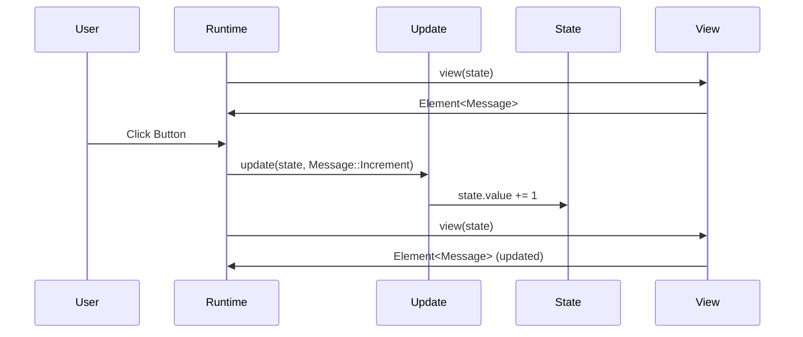

# View and Update

The **update** and **view** functions form the heart of every Iced application. Together, they create a reactive loop where state changes trigger UI updates, and user interactions trigger state changes.

## The Update Function

The update function is responsible for modifying your state in response to messages.

### Basic Update

At its simplest, update takes a mutable reference to your state and a message:

```rust
fn update(counter: &mut u64, message: Message) {
    match message {
        Message::Increment => *counter += 1,
    }
}
```

<Note>
  The update function modifies state in place using a mutable reference (`&mut`). This is efficient and follows Rust's ownership model.
</Note>

### Update with Custom State

With a custom state struct:

```rust
#[derive(Default)]
struct Counter {
    value: i64,
}

#[derive(Debug, Clone, Copy)]
enum Message {
    Increment,
    Decrement,
}

fn update(counter: &mut Counter, message: Message) {
    match message {
        Message::Increment => {
            counter.value += 1;
        }
        Message::Decrement => {
            counter.value -= 1;
        }
    }
}
```

### Update with Tasks

The update function can optionally return a `Task` to perform asynchronous work:

```rust
use iced::Task;

struct State {
    weather: Option<Weather>,
}

#[derive(Clone)]
enum Message {
    FetchWeather,
    WeatherFetched(Weather),
}

fn update(state: &mut State, message: Message) -> Task<Message> {
    match message {
        Message::FetchWeather => {
            Task::perform(fetch_weather(), Message::WeatherFetched)
        }
        Message::WeatherFetched(weather) => {
            state.weather = Some(weather);
            Task::none()
        }
    }
}

async fn fetch_weather() -> Weather {
    // Fetch data from an API...
    unimplemented!()
}
```

<Info>
  Tasks allow you to run async code, interact with the runtime (focus widgets, change window settings), and more. They're essential for real-world applications.
</Info>

<Tabs>
  <Tab title="Task::none()">
    ```rust
    Message::ButtonPressed => {
        state.count += 1;
        Task::none()  // No async work needed
    }
    ```
    
    Use when no asynchronous work is needed.
  </Tab>
  <Tab title="Task::perform()">
    ```rust
    Message::FetchData => {
        Task::perform(
            fetch_from_api(),
            Message::DataFetched
        )
    }
    ```
    
    Run an async function and wrap its result in a message.
  </Tab>
  <Tab title="Task::batch()">
    ```rust
    Message::Initialize => {
        Task::batch(vec![
            Task::perform(load_config(), Message::ConfigLoaded),
            Task::perform(connect_db(), Message::DatabaseConnected),
        ])
    }
    ```
    
    Run multiple tasks in parallel.
  </Tab>
</Tabs>

## The View Function

The view function converts your state into a tree of widgets that make up your UI.

### Basic View

```rust
use iced::widget::{button, text};
use iced::Element;

fn view(counter: &u64) -> Element<'_, Message> {
    button(text(counter)).on_press(Message::Increment).into()
}
```

<Note>
  Every view function must return an `Element<'_, Message>` where `Message` matches the message type used in your update function.
</Note>

### View with Layout

Use layout widgets to arrange your UI:

```rust
use iced::widget::{button, column, text};
use iced::{Element, Center};

fn view(counter: &Counter) -> Element<'_, Message> {
    column![
        button("Increment").on_press(Message::Increment),
        text(counter.value).size(50),
        button("Decrement").on_press(Message::Decrement)
    ]
    .padding(20)
    .spacing(10)
    .align_x(Center)
    .into()
}
```

<Info>
  The `column!` macro creates a vertical layout. There's also `row!` for horizontal layouts.
</Info>

### Builder Pattern

Widgets are configured using the builder pattern:

```rust
column![
    text(counter.value).size(20),  // Method chaining
    button("Increment").on_press(Message::Increment),
]
.spacing(10)  // Applied to the column
.into()       // Convert to Element
```

## The Update-View Cycle

Here's how update and view work together:

<Steps>
  <Step title="Initial Render">
    When your application starts, Iced calls `view` with the initial state to create the first UI.
  </Step>
  <Step title="User Interaction">
    When a user interacts with a widget (clicks a button, types in an input), the widget produces a message.
  </Step>
  <Step title="Update Called">
    Iced calls your `update` function with the message, allowing you to modify the state.
  </Step>
  <Step title="Re-render">
    After state changes, Iced calls `view` again with the new state to update the UI.
  </Step>
</Steps>



## Connecting View and Update

Widgets produce messages that your update function handles:

<Tabs>
  <Tab title="Button">
    ```rust
    // View: Button produces Message::Increment when pressed
    button("Increment").on_press(Message::Increment)
    
    // Update: Handle the message
    match message {
        Message::Increment => counter.value += 1,
    }
    ```
  </Tab>
  <Tab title="Text Input">
    ```rust
    // View: Input produces Message::InputChanged with the new text
    text_input("Placeholder", &state.input)
        .on_input(Message::InputChanged)
    
    // Update: Store the new value
    match message {
        Message::InputChanged(value) => state.input = value,
    }
    ```
  </Tab>
  <Tab title="Checkbox">
    ```rust
    // View: Checkbox produces Message::ToggleComplete with bool
    checkbox(task.completed)
        .on_toggle(Message::ToggleComplete)
    
    // Update: Update the completed status
    match message {
        Message::ToggleComplete(completed) => task.completed = completed,
    }
    ```
  </Tab>
</Tabs>

## Pattern Matching State

When using enum-based state, match on it in both view and update:

```rust
enum Todos {
    Loading,
    Loaded(State),
}

fn update(todos: &mut Todos, message: Message) -> Task<Message> {
    match todos {
        Todos::Loading => {
            match message {
                Message::Loaded(Ok(state)) => {
                    *todos = Todos::Loaded(state);
                    Task::none()
                }
                _ => Task::none()
            }
        }
        Todos::Loaded(state) => {
            // Handle messages for loaded state
            match message {
                Message::InputChanged(value) => {
                    state.input_value = value;
                    Task::none()
                }
                _ => Task::none()
            }
        }
    }
}

fn view(todos: &Todos) -> Element<'_, Message> {
    match todos {
        Todos::Loading => {
            text("Loading...").into()
        }
        Todos::Loaded(state) => {
            // Render the loaded UI
            column![/* ... */].into()
        }
    }
}
```

## Real-World Example

From `examples/counter/src/main.rs`:

```rust src/lib.rs:1-40
use iced::Center;
use iced::widget::{Column, button, column, text};

pub fn main() -> iced::Result {
    iced::run(Counter::update, Counter::view)
}

#[derive(Default)]
struct Counter {
    value: i64,
}

#[derive(Debug, Clone, Copy)]
enum Message {
    Increment,
    Decrement,
}

impl Counter {
    fn update(&mut self, message: Message) {
        match message {
            Message::Increment => {
                self.value += 1;
            }
            Message::Decrement => {
                self.value -= 1;
            }
        }
    }

    fn view(&self) -> Column<'_, Message> {
        column![
            button("Increment").on_press(Message::Increment),
            text(self.value).size(50),
            button("Decrement").on_press(Message::Decrement)
        ]
        .padding(20)
        .align_x(Center)
    }
}
```

## Best Practices

<Card title="Update Guidelines" icon="refresh-cw">
  - Keep update logic focused on state changes
  - Return `Task::none()` when no async work is needed
  - Use `Task::batch()` to run multiple tasks in parallel
  - Handle all message variants explicitly
</Card>

<Card title="View Guidelines" icon="eye">
  - Keep view functions pure - no side effects
  - Extract complex UI into separate functions
  - Use the builder pattern to configure widgets
  - Always call `.into()` to convert widgets to `Element`
</Card>

## Next Steps

- [Elements and Widgets](/concepts/elements-and-widgets) - Learn about the building blocks of your UI
- [Tasks](/guides/tasks) - Deep dive into asynchronous operations
- [Subscriptions](/guides/subscriptions) - Listen to passive events
